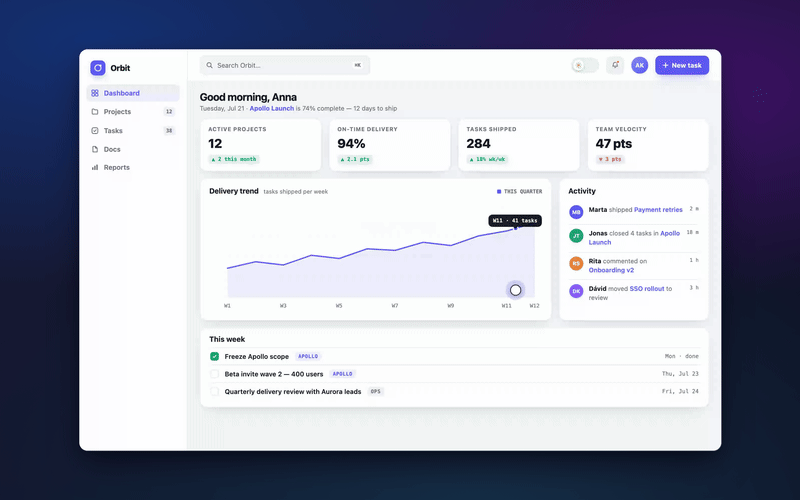

# Screenshooter

[](https://github.com/Paldom/screenshooter/actions/workflows/ci.yml)
[](LICENSE)
[](https://skills.sh/Paldom/screenshooter)

Skills for creating polished screen-recording walkthrough and tutorial videos of web apps, with smooth scripted mouse movements, zoom effects, and explanation cards.



*14 seconds from the bundled [demo scenario](skills/walkthrough-record/assets/demo/orbit-tour.yaml), recorded headlessly with the `glass` preset — everything you see (cursor, zoom, cards, tooltip trace) is scripted YAML.*

Agent Skills for [Claude Code](https://code.claude.com/docs/en/skills) (and any
[Agent Skills](https://agentskills.io)-compatible tool). Each skill is a folder under
[`skills/`](skills/) with a single-purpose `SKILL.md`, trigger evals, and optional
scripts/references — validated on every write, commit, and PR.

## Quick start

Install with the [skills CLI](https://skills.sh) — auto-detects 70+ agents
(Claude Code, Codex, Cursor, Copilot, pi, …):

```bash
npx skills add Paldom/screenshooter                  # all detected agents
npx skills add Paldom/screenshooter -a codex -a pi   # or target specific agents
```

Or with the [GitHub CLI](https://cli.github.com/manual/gh_skill_install) (≥ 2.90),
including version-pinned installs from releases:

```bash
gh skill install Paldom/screenshooter
gh skill install Paldom/screenshooter <skill> --pin <tag>
```

Or as a Claude Code plugin:

```
/plugin marketplace add Paldom/screenshooter
/plugin install screenshooter@screenshooter
```

Or copy a single skill into a project:

```bash
git clone https://github.com/Paldom/screenshooter.git
cp -r screenshooter/skills/<skill-name> your-project/.claude/skills/
```

Then just describe the task — the skill activates on its description — or invoke it
explicitly with `/<skill-name>`.

## Skills

| Skill | Description |
| --- | --- |
| [walkthrough-storyboard](skills/walkthrough-storyboard/) | Plans and writes the scenario YAML for a web-app walkthrough video — story beats, cursor path, zoom placement, explanation-card copy, theme choice. |
| [walkthrough-record](skills/walkthrough-record/) | Records that scenario into a polished video with a bundled Playwright recorder — smooth cursor, camera zooms, cards, privacy masks — and exports mp4 + gif. |

The two skills compose into a workflow: storyboard → record → review. A
paste-ready orchestration goal lives in [docs/setup-prompt.md](docs/setup-prompt.md).
Try it instantly on the bundled demo app — no scenario writing needed:

```bash
bash skills/walkthrough-record/scripts/setup.sh   # once: pinned deps + Chromium (needs Node ≥ 20, ffmpeg)
node skills/walkthrough-record/scripts/record.mjs \
  skills/walkthrough-record/assets/demo/orbit-tour.yaml --out ./out
```

## Repository structure

```
skills/                  # distributed skills, one folder per skill (SKILL.md + evals/ + scripts/)
docs/                    # skill-authoring guide, eval methodology, deployment guide
scripts/                 # deterministic validator used by hooks and CI
skills.sh.json           # skills.sh repo-page customization (groupings)
.claude/                 # agentic dev setup: hooks + bundled add-skill / publish-repo skills
.claude-plugin/          # plugin + marketplace manifests (makes this repo installable)
.local/                  # gitignored working area: sources, research, PROMPT.md (see below)
```

## Working on this repo with an agent

This repo is agent-native: canonical agent instructions live in
[AGENTS.md](AGENTS.md) (CLAUDE.md imports it), hooks validate every `SKILL.md` on
write, `make check` runs the full validator, and CI enforces the same gate on every
PR. The bundled `add-skill` skill walks the eval-first authoring workflow described
in [docs/skill-authoring.md](docs/skill-authoring.md). Maintainers drive sessions
with their own (gitignored, personal) `.local/PROMPT.md` goal prompt.

## Contributing

Contributions welcome — see [CONTRIBUTING.md](CONTRIBUTING.md) for the skill-proposal
process, the authoring workflow, and the PR checklist. Please note the
[Code of Conduct](CODE_OF_CONDUCT.md).

## Support

Questions, ideas, or something not working? Start with [SUPPORT.md](SUPPORT.md) —
bugs and skill proposals have [issue templates](../../issues/new/choose), and
security concerns go through [SECURITY.md](SECURITY.md) (never a public issue).

## License

[MIT](LICENSE) © 2026 Paldom
